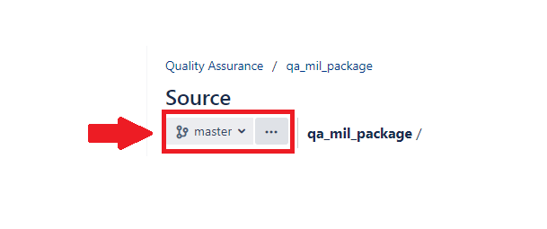
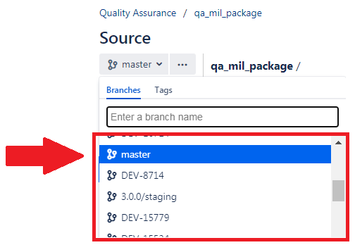
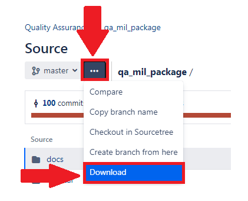

# Data Quality Review and Characterization Programs

## Quality Assurance (QA) Mother Infant Linkage (MIL) Package

### Overview

This document describes the program package used to perform quality assurance (QA) review and characterization of Mother Infant Linkage (MIL) data in the [Sentinel Common Data Model](https://dev.sentinelsystem.org/projects/SCDM/repos/sentinel_common_data_model/browse) (SCDM) format. 

This program package helps to ensure the data meets the necessary standards for data transformation consistency and quality. Successful execution of the QA MIL package indicates that the source data adheres to SCDM rules and can be used in analytic programs. 

Note that data must be in the form of SAS&reg; datasets in order to use these analytic programs.

#### To View QA MIL Request Packages
* Click the drop-down menu in the top left-hand corner 
* Choose the Request ID representing the package of interest
* Click the "..." button
* Select "Download" from the menu that appears

  

 

 

  

### Folder Structure

- **docs**: Contains specifications which details QA MIL functionality and provides a description of the datasets output by the QA MIL Package into the `dplocal` and `msoc` folders
- **dplocal**: is where datasets with patient identifiers are saved. For more information about Sentinel's privacy standards, please refer to (**[The Sentinel System Principles and Policies] (https://www.sentinelinitiative.org/about/principles-policies)**)
- **inputfiles**: is the subfolder containing all input files and lookup tables needed to execute a request. Input files contain information on what tables should be output and the type of analyses conducted on the variables in each table.
- **msoc**: is where aggregated program results are saved
- **sasprograms**: contains the file(s) to be executed

### Requirements

- UNIX/Linux or Windows environment
- SAS version 9.4 or higher (as of OY 2021)
- SCDM formatted data (Medicare Claims Synthetic Public Use Files are available in the Sentinel Common Data Model Format **[here](https://www.sentinelinitiative.org/sentinel/surveillance-tools/software-toolkits/Medicare-SynPUFs-in-SCDM)**)

### Getting Started

- Review the QA MIL Package Documentation (available **[here](docs/Sentinel_Mother_Infant_Quality_Assurance_Package_3.0.0.docx)**)
- Open `sasprograms\00.0_scdm_mil_data_qa_review_master_file.sas`
- Go to section 1 of program header and specify the following parameters:
  - Define path(s)s to:
    - SCDM MIL table under review 
	- Source files utilized to create SCDM MIL table 
	- Common Components (CC) request associated with the ETL under review 
	- This QA package, not including the request ID
	- Location of previously approved Phase A SCDM tables 
  - The Extract Transform Load (ETL) number for this request (prior ETL + 1)
  - The SCDM version of the ETL under review
  - The name of the SCDM datasets 
  
- Go to section 2 of program header and specify the following parameters
  - Individual request ID tokens
  - Extract Transform Load (ETL) number for this request (prior ETL + 1)
  
- Close and run `00.0_scdm_mil_data_qa_review_master_file.sas` in batch mode

### Output

The program package generates a series of aggregated output tables that help determine whether the data conform to SCDM specifications, maintain integrity across variables and across tables, and trend as expected over time. Details on the output structure can be found in the documentation; details on how to interpret the output can be found in the data dictionary.

### Additional Information

The Sentinel Operations Center has limited capacity to support use of our tools. However, we welcome feedback, comments, and suggestions pertaining to our documentation or tools. Email us **[here](mailto:info@sentinelsystem.org?subject=Git)**.

 
 
________________________________________________________________

 

|<b>Navigate to: |
|------|
|[<b>> Docs: folder where package specifiations can be found](docs/readme.md)|
|[<b>> DPLocal: folder where datasets with patient identifiers are saved](dplocal/readme.md)|
|[<b>> InputFiles: folder that contains input files and lookup tables needed to run the request](inputfiles/readme.md)|
|[<b>> MSOC: folder where aggregated program results are saveds](msoc/readme.md)|
|[<b>> SAS Programs: folder with file(s) to be executed](sasprograms/readme.md)|

